<div align="center">



</div>


## About

```
┌─ whoami ───────────────────────────────┐
│  name      : YOUR_NAME                 │
│  role      : Software Engineer         │
│  location  : Neckarsulm, DE            │
│  languages : DE / EN                   │
└─────────────────────────────────────────┘
```


## Tech Stack

<p align="center">
  
  
  
  
  
  
  
  
</p>


## GitHub Stats

<p align="center">
  
  
</p>


## Contact

```
┌─ connect ──────────────────────────────┐
│  linkedin  : linkedin.com/in/YOUR_LINKEDIN │
│  email     : YOUR_EMAIL@example.com    │
│  website   : YOUR_WEBSITE.dev          │
└─────────────────────────────────────────┘
```

<div align="center">
<sub>— end of transmission —</sub>
</div>
